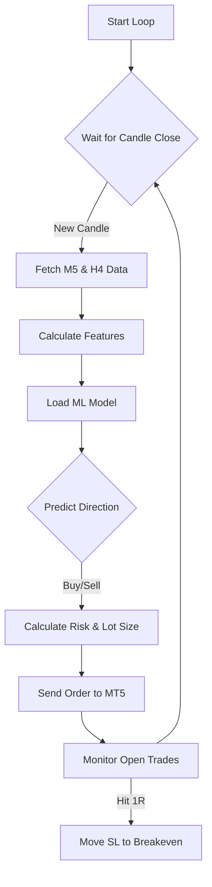

<div align="center">

# ⚡ Python Live Trading Bot for MetaTrader 5

### Event-Driven ML Execution Engine


<p align="center">
  <em>A professional-grade execution bot that bridges Python Machine Learning models with the MetaTrader 5 terminal for real-time algorithmic trading.</em>
</p>

</div>

---

## 📖 Overview

This bot executes trades autonomously based on predictions from a pre-trained **XGBoost/ML model** (`joblib` format). It operates on a strict **Event-Driven Loop**, synchronizing with candle closures to prevent slippage and ensure data integrity.

It includes a robust **Dynamic Risk Management** engine that calculates lot sizes based on account equity and volatility, along with automated **Breakeven Trailing** logic.

---

## ⚙️ Core Architecture

### 1. Synchronization Engine (The Heartbeat)

* **Logic:** Calculates exact seconds remaining until the next M5 candle close.
* **Benefit:** Ensures features (RSI, BBands, VWAP) are computed on closed candles, eliminating repainting issues.

### 2. Multi-Timeframe Feature Engineering

Real-time technical indicators for **M5** (Tactical) and **H4** (Strategic) timeframes:

* **RSI (Relative Strength Index)** with lag features.
* **Bollinger Bands** (Volatility).
* **VWAP (Volume Weighted Average Price)** for institutional flow tracking.

### 3. Dynamic Risk Manager

* **Capital Protection:** Risk fixed at **1%** of account equity per trade.
* **Volatility Sizing:** Lot size calculated based on distance to Stop Loss (High/Low of signal candle).
* **Breakeven Logic:** Moves Stop Loss to Entry Price once trade hits **1R** profit.

---

## 🔄 Execution Logic



---

## 🚀 Key Features

| Feature               | Description                                                       |
| :-------------------- | :---------------------------------------------------------------- |
| **🤖 ML Integration** | Loads joblib models for real-time inference.                      |
| **🛡️ Risk Control**  | Hard-coded risk limits (Max Lot, Risk %) to avoid overleveraging. |
| **⏱️ Zero-Lag**       | Executes orders within milliseconds of the new candle open.       |
| **📊 Multi-TF Data**  | Combines M5 and H4 data streams for context-aware decisions.      |

---

## 📂 Project Structure

```bash
python-mt5-live-trading-bot/
├── master.py               # Main Event Loop & Execution Logic
├── output/                 # Model Directory
│   └── eurusd_model.joblib # Pre-trained ML Model
├── requirements.txt        # Dependencies
└── README.md               # Documentation
```

## 💻 Usage

**1. Prerequisites**

* MetaTrader 5 Terminal: Installed and logged into a Hedging Account.
* Algo Trading Enabled: Click "Algo Trading" in MT5 toolbar.

**2. Configuration**
Edit `master.py` to set your risk parameters:

```python
RISK_PER_TRADE_PERCENT = 1.0  # Risk 1% per trade
SYMBOL = "EURUSD"
MAGIC_NUMBER = 777             # Unique ID for this bot's trades
```

**3. Launch**

```bash
python master.py
```

The console will display "Waiting for next candle..." and sync with the market.

---

⚠️ **Disclaimer**

<div align="center">
  High Risk Investment Warning ⚠️
</div>

This software executes trades on a live financial account. Algorithmic trading involves significant capital risk.

* **Use at Your Own Risk:** The author is not responsible for financial losses.
* **Test on Demo First:** Run the bot on a Demo account for at least 4 weeks before going live.
* **Market Conditions:** Past ML performance does not guarantee future results.

Engineered by Redouane Boundra.
